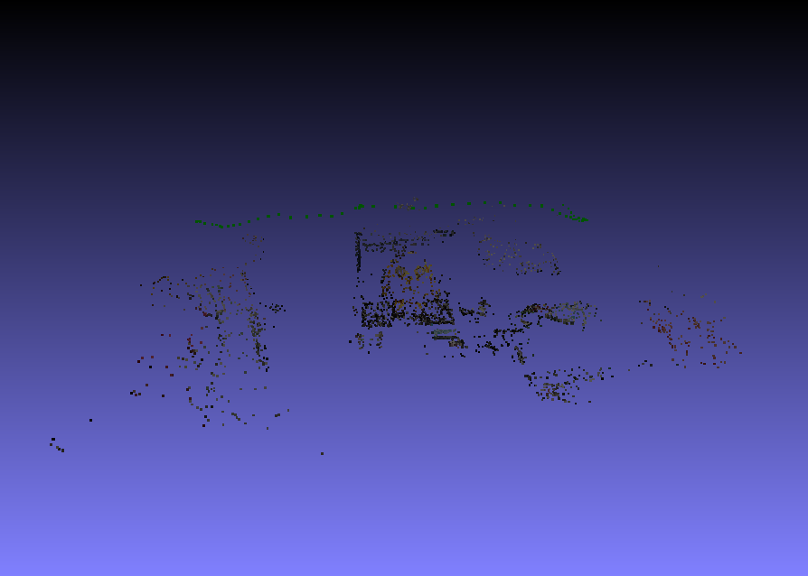
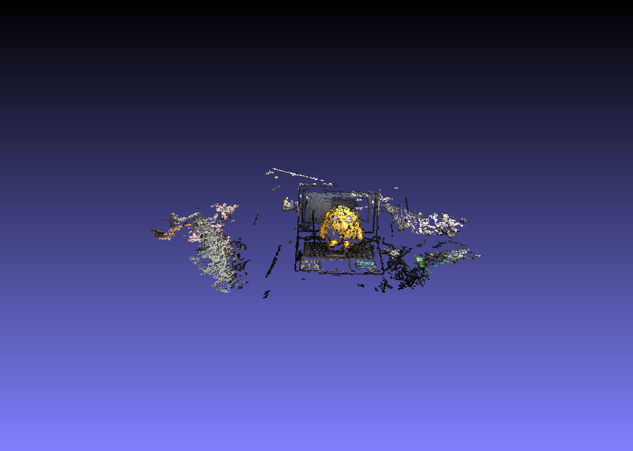
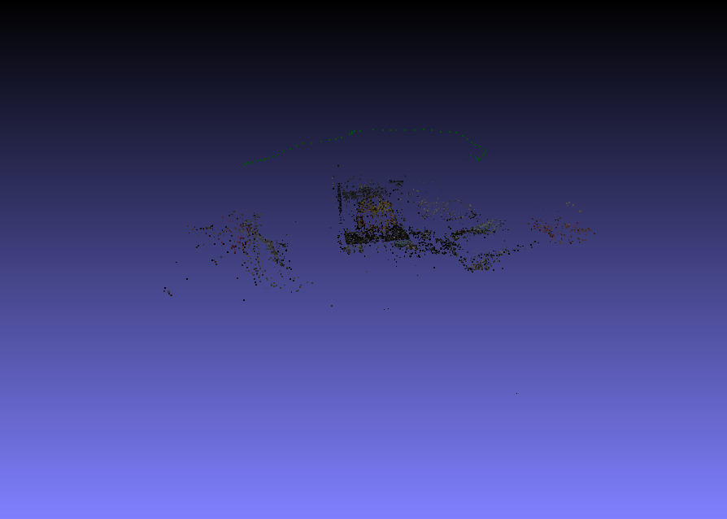
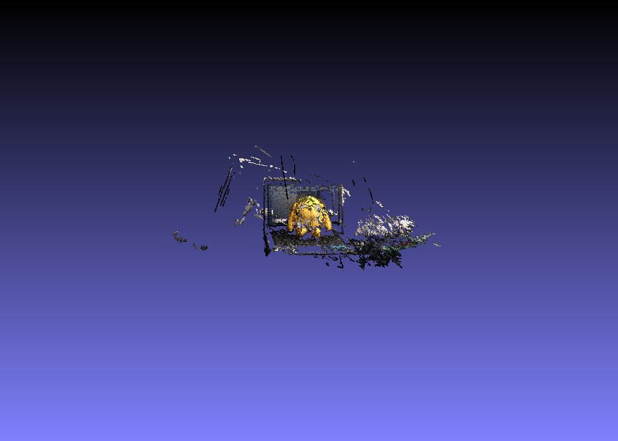

# Week 6
#### (September 11, 2017 to September 15, 2017)

Exploring OpenMVG, I have found out that I should focus on using this library now, instead of OpenCV. While OpenCV provides functions that I can use in 3D reconstruction, OpenMVG is more devoted to multiple views, so it is easier to use. OpenMVG can be used together with OpenCV, so I can still use the latter when I need it.

For this week, I was able to produce better 3D models by using [PMVS](https://www.di.ens.fr/pmvs/pmvs-1/index.html) (Patch-based Multi-view Stereo Software) and [CMVS](https://www.di.ens.fr/cmvs/) (Clustering Views for Multi-view Stereo)

First, I added few lines at the end of the demo code last week:
```
pRecons = subprocess.Popen( [os.path.join(OPENMVG_SFM_BIN, "openMVG_main_openMVG2PMVS"),  "-i", reconstruction_dir+"/sfm_data.bin", "-o", os.path.join(reconstruction_dir)] )
pRecons.wait()
```

  _openMVG_main_openMVG2PMVS_ is a bin file in the built version of the library (source code is available [here](https://github.com/openMVG/openMVG/blob/master/src/software/SfM/main_openMVG2PMVS.cpp)). This is where poses are re-indexed (from valid cameras), and images are undistorted. This so that camera parameters will be properly computed for our bundler. All these are acquired from the raw images and the SfM data created in the previous steps.
  
I also followed these [steps](http://openmvg.readthedocs.io/en/latest/software/MVS/PMVS/), except that I changed the last line to ```pmvs2 Dataset/outReconstruction/PMVS/ option-xxxx```. The given last line does not work because the sh file tries to access a non-existent directory.

I used [53 images](../Trials/images/jake_burst) in producing the following results:

#### Global Reconstruction
SfM:


PMVS:


#### Sequential Reconstruction
SfM:


PMVS:


To put things simply, the generated SfM data from global and sequential reconstructions are used to create 3D models using PMVS. After that, CMVS is used to remove unnecessary images and to process them in clusters. It is not seen significantly in my sample since I only used 53 images. CMVS' usefulness will be appreciated with hundreds or thousands of images, due to machine limitations.

In conclusion, the points have become denser, making the scene clearer. PMVS was also smart enough to focus on the toy and laptop, the main subject. It ignored parts of the scene that are not necessary in the project.
