# Week 7
#### (September 18, 2017 to September 22, 2017)

This week's results is focused on the limitations of the current libraries that I am using. Additionally, I used OpenMVS for creating mesh and applying texture.

As what was suggested in my latest consultation, I tried creating 3D models of simple scenes like a box of some sort. I tried doing that twice, with a variation, but the reconstruction algorithm could not find enough features to match with. 

Here is a sample from my first attempt:
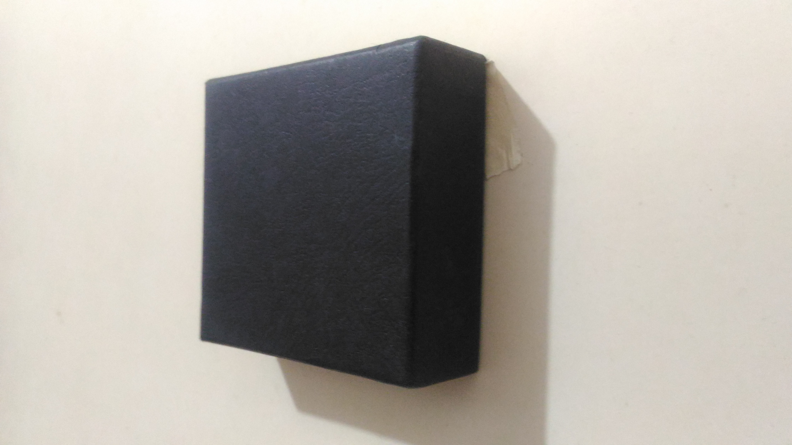

And a sample from my second attempt:
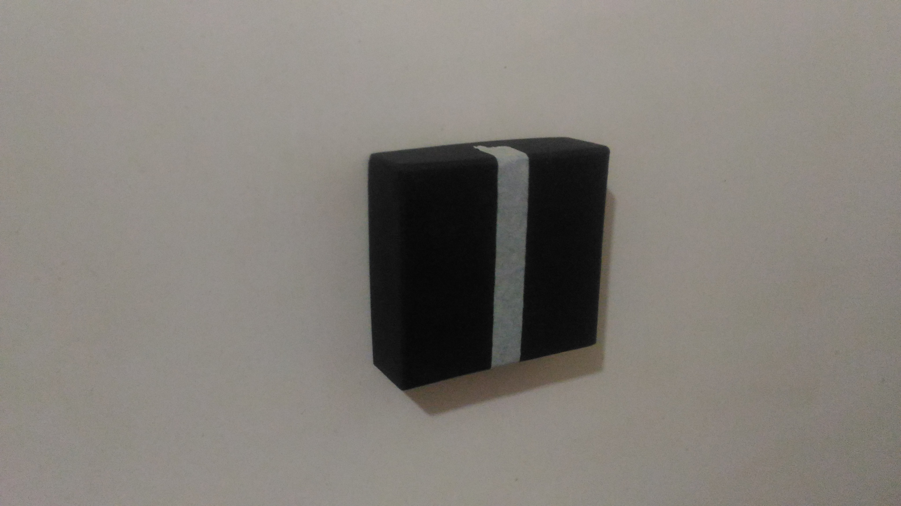

In my [first attempt](../Trials/images/rejected_box), I tried to make the scene as simple as possible. Turns out, not enough features could be matched, so a reconstruction is not possible using these photos. So in my [second attempt](../Trials/images/box), I put a masking tape on the box, just to help the program see more features, but it still did not work. No reconstruction for the second set of images.

I used the box again for my [third set of images](../Trials/images/fan), but this time, I added another object:
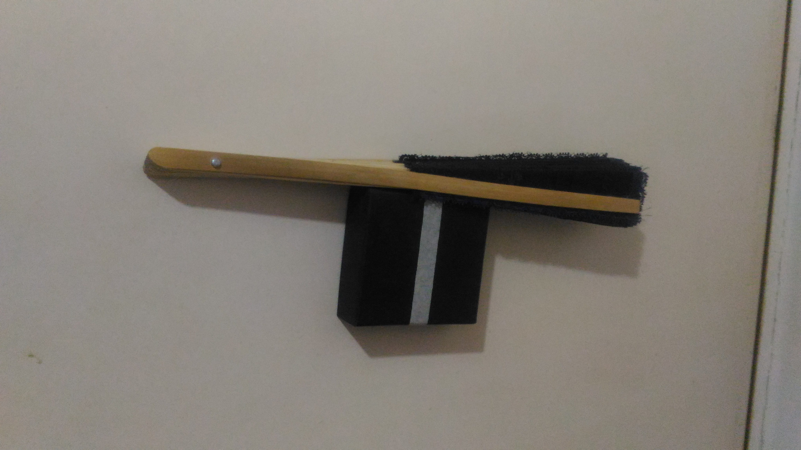

Sure, I was able to create a model, but it was not exactly desirable.
SfM:
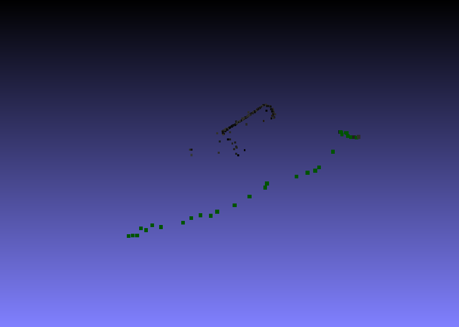
PMVS:
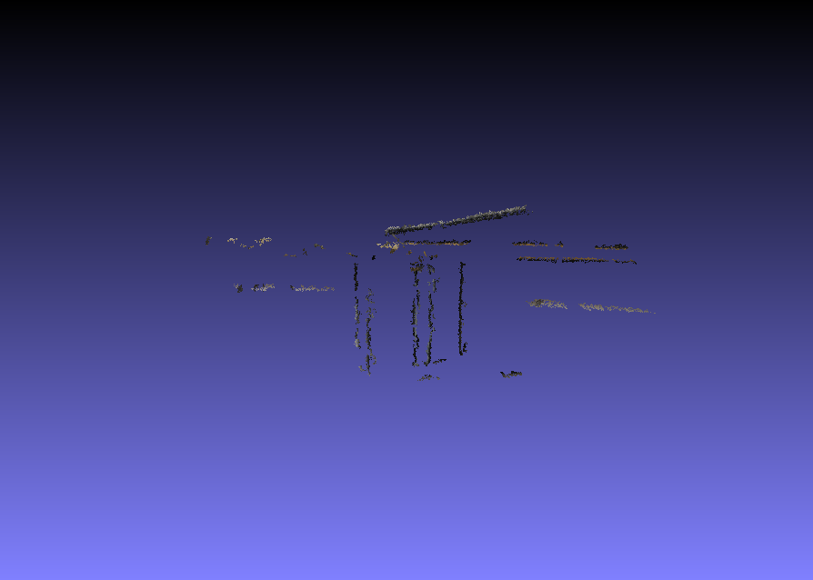

In addition, OpenMVS could not create a denser 3d pointcloud. Although PMVS was already able to do that, I need OpenMVS to create mesh and texture, so I had to make a denser version of the model first, in MVS format. With that, I was not able to lay texture in this model.

I gave up the idea of using extremely using simple images. For my [fourth attempt](../Trials/images/shoe), I used a shoe:
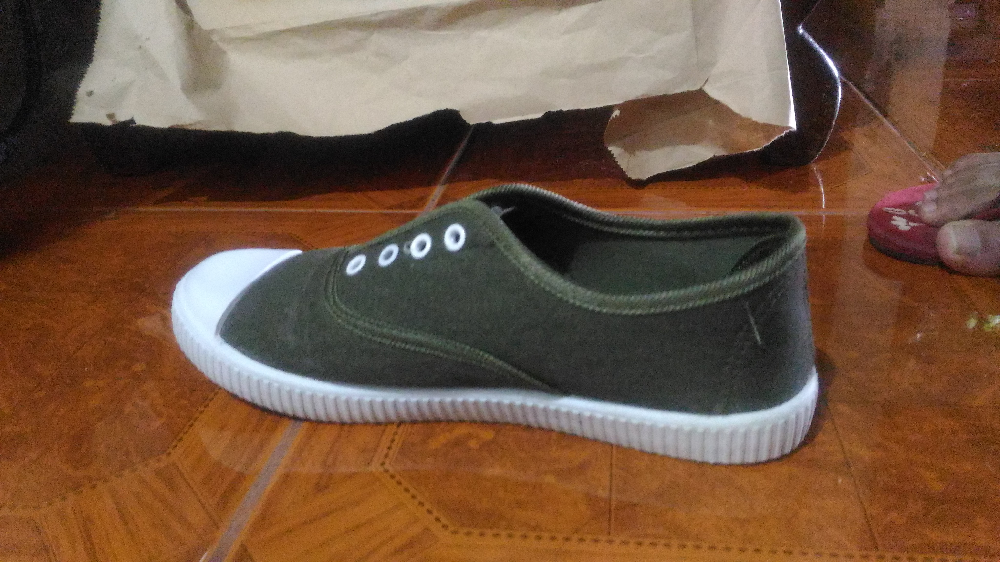

I was able to create models:
SfM:
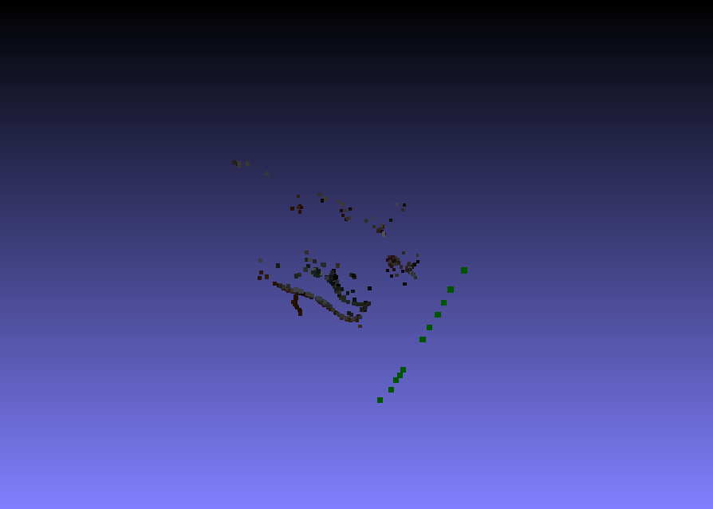
PMVS:
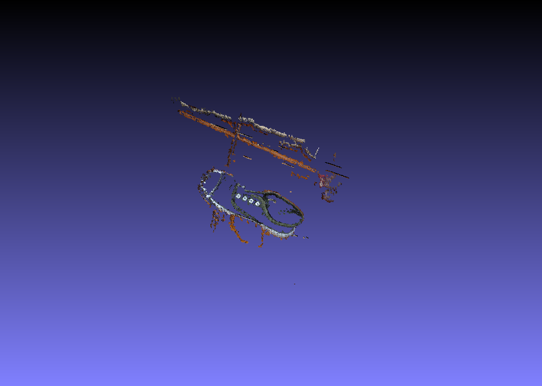
Denser Model by OpenMVS:
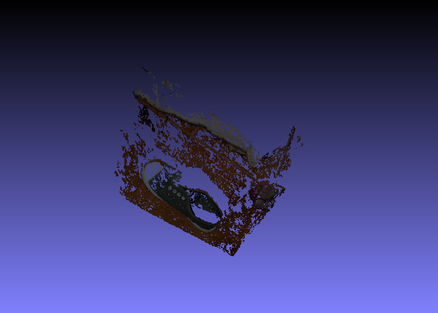
Mesh by OpenMVS:
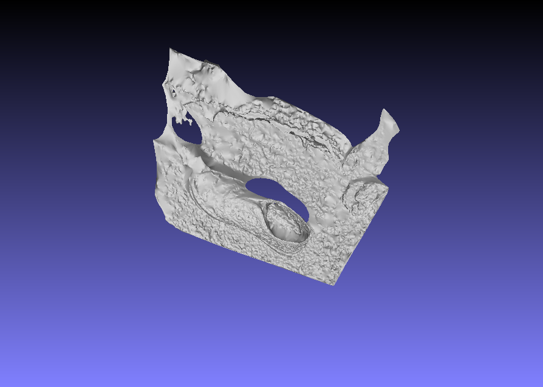
Textured Model by OpenMVS:
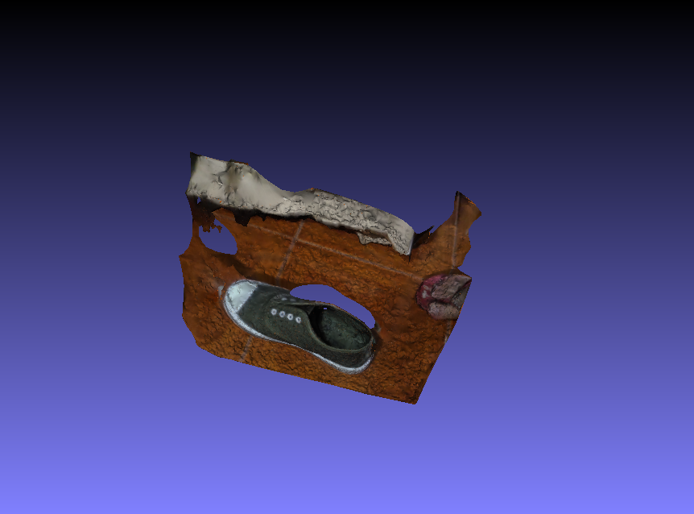

Since very simple scenes do not produce good models, I had one more attempt. For my [last attempt](../Trials/images/bear), I took photos with obvious textures and very complicated shapes:
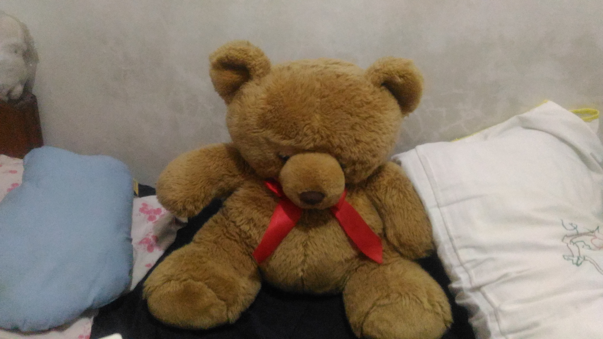

As I expected, it showed better results in all modelling techniques:
SfM:
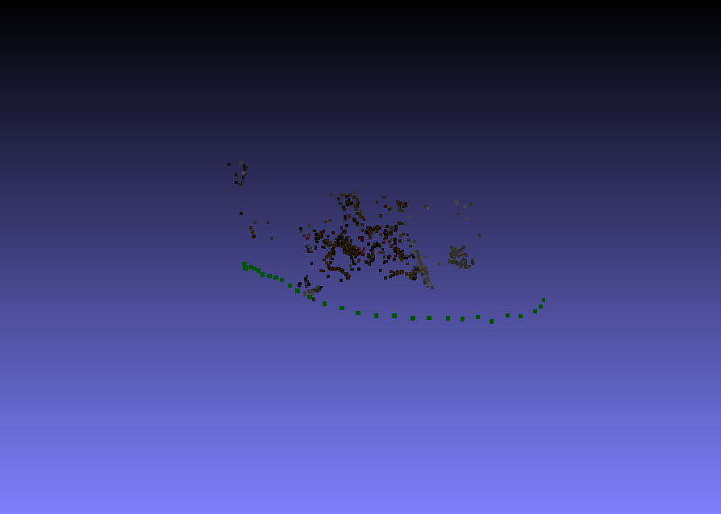
PMVS:
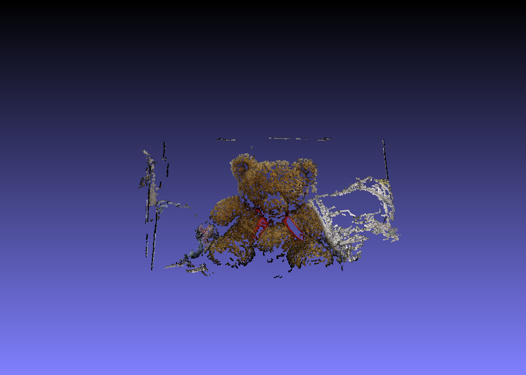
Denser Model by OpenMVS:
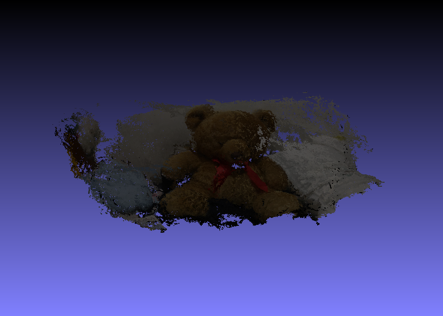
Mesh by OpenMVS:
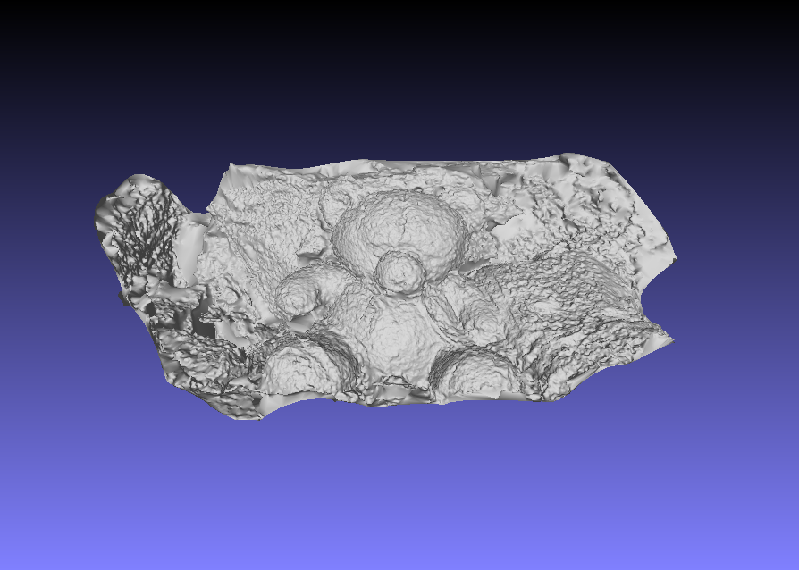
Textured Model by OpenMVS:
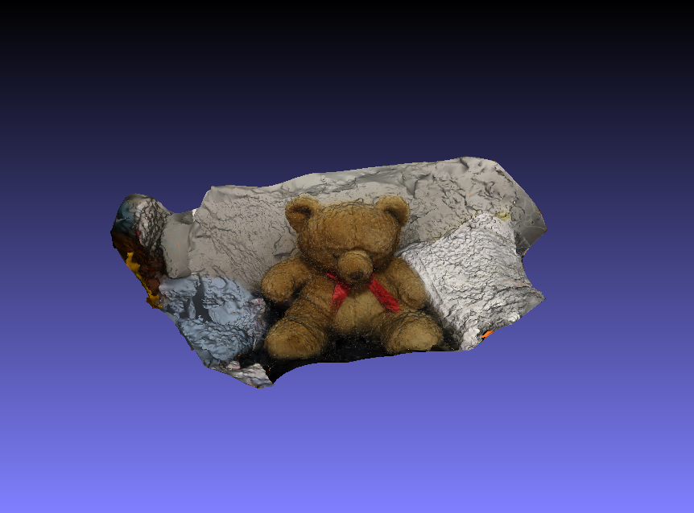

SfM is the main reconstruction procedure that I use. PMVS uses the data from that, and creates another model using patches. OpenMVS can be used for mesh and texture, but to do that there has to be a denser model first in MVS format. So I converted OpenMVG data to OpenMVS and then create a denser model. The steps are [here](http://openmvg.readthedocs.io/en/latest/software/MVS/OpenMVS/). Compared with models that did not use mesh and texture, 3D models with mesh and texture look better. They are (more) whole, and even though there may be some holes, these holes does not look awkward. There are no scattered points anymore. The blame in the imperfections in these models can be pushed to the quality of the images, and the parts such were able to record.
