# Week 8
#### (September 25, 2017 to September 29, 2017)

I did not find images that I can use to challenge the libraries that I am using. Although I found depth maps and camera poses, these do not follow the format in OpenMVG. trying to make them work would require me to have a complete understanding of the structure of the source code. The main functions being called calls other functions in other dorectories, which are buried in the sea of files. With that, I had to have my own images.

A paper entitled, [Benchmarking Close-range Structure from Motion 3D Reconstruction Software Under Varying Capturing Conditions](Documents/Benchmarking_Close-range_Structure_from_Motion_3D_Reconstruction_Software_Under_Varying_Capturing_Conditions.pdf) helped me in deciding on the characteristics of the objects that I should capture. Since the study's goal is to analyze several software solutions for 3D reconstruction, they chose objects that would be normally hard to reconstruct. Each object should have any of the following: _monochrome colors_, _almost black colors_, _smooth surface_, _patterns_ and _symmetry_.

I captured all of them, and here are the results.

#### Monochrome Colors
I converted the photos I used in the bear model last week, resulting to this:
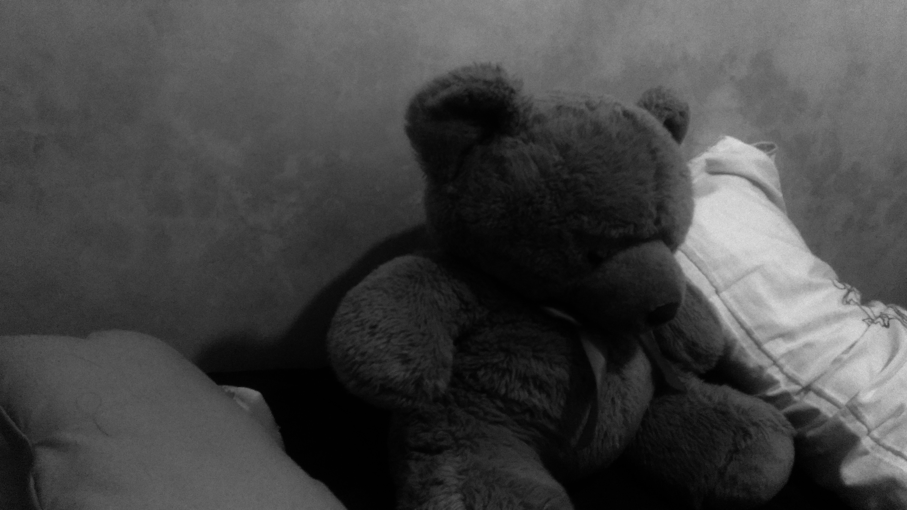

A basic SfM was created:
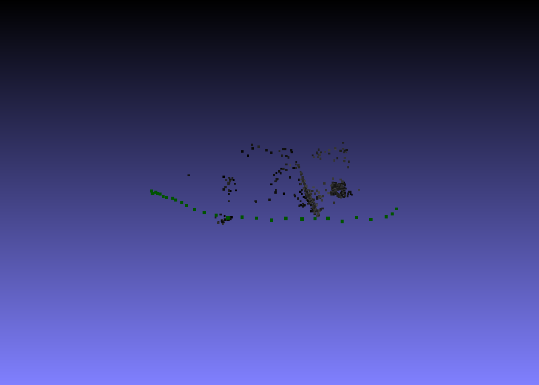

I tried to run the MVS file, but it did not produce a denser model. Even though a model was created last week using these photos, merely changing the color made the SfM product almost unrecognizable, and everything after that "impossible". Coloring the photos before modelling might be a solution

### Almost Black Colors
This is similar to the previous one, expect that it is not monochrome, it is just too dark.
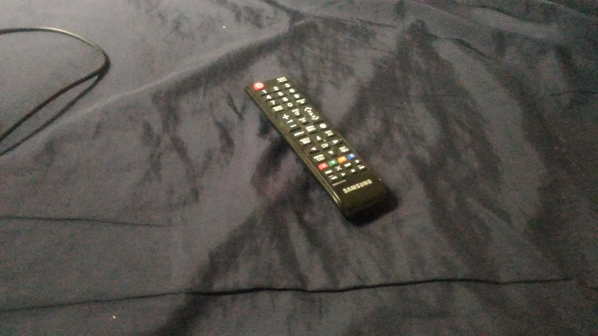

It also reached only until basic SfM:
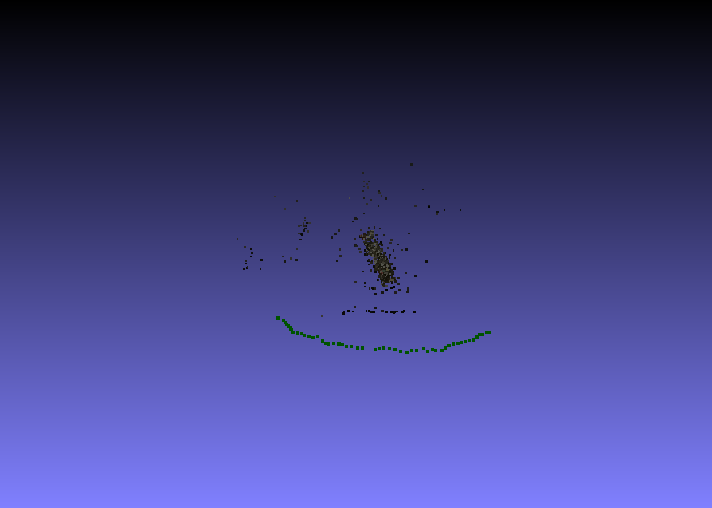

Images can be processed first, if the problem is just lighting. Other than that, there is no other way around it, but to get better images.

### Smooth Surface
I used a phone's protector for this

SfM:
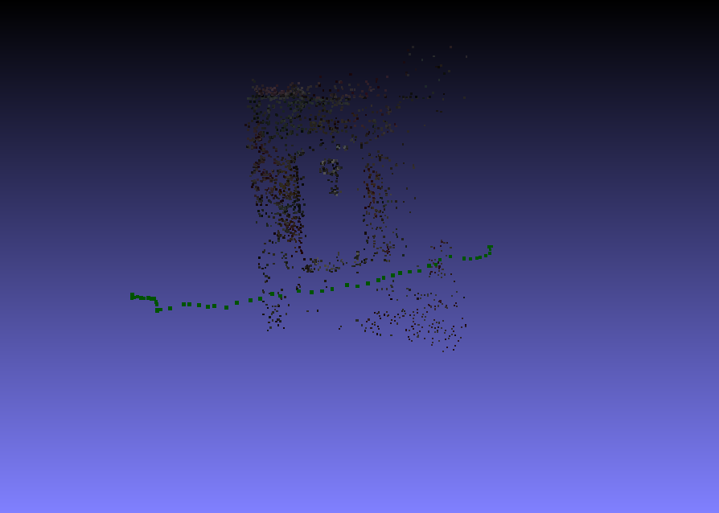

Dense:
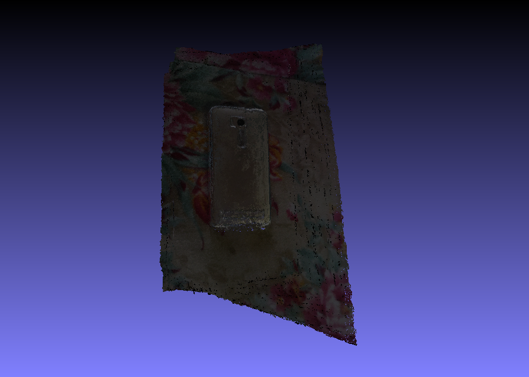
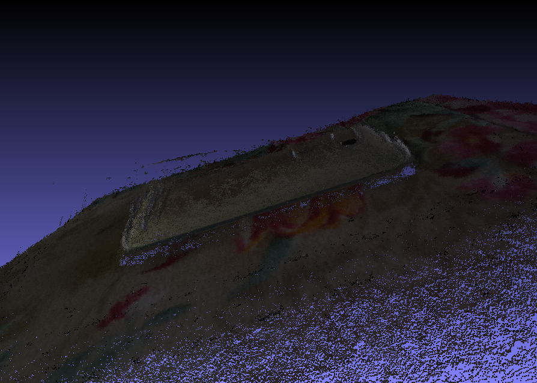

As we can see, the smooth and the very reflective part of the object is not properly modelled. In the basic version, it was _hollow_, and in the denser version, it was somehow _concave_. A mesh version of this would be nice to see if the smooth part is really reconstructed deviating from the original object, but my device is too weak for it. Waiting for an hour got me nowehere. Of course, a textured version does not exist at the moment as well.

### Patterns
The next object's surface has patterns, but I am afraid this might be the best for this.
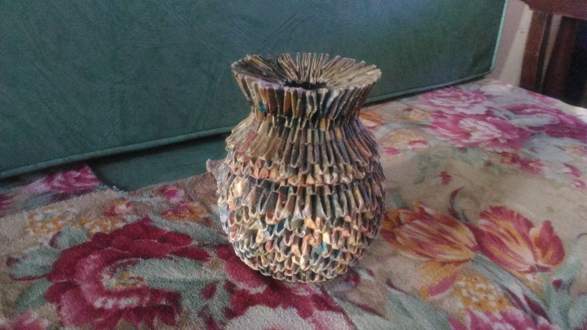

SfM:
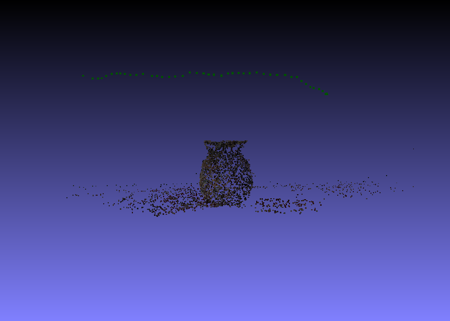

Dense:
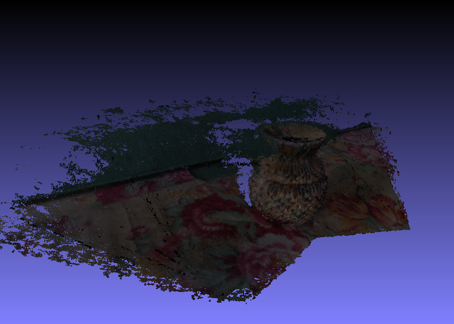

Mesh:
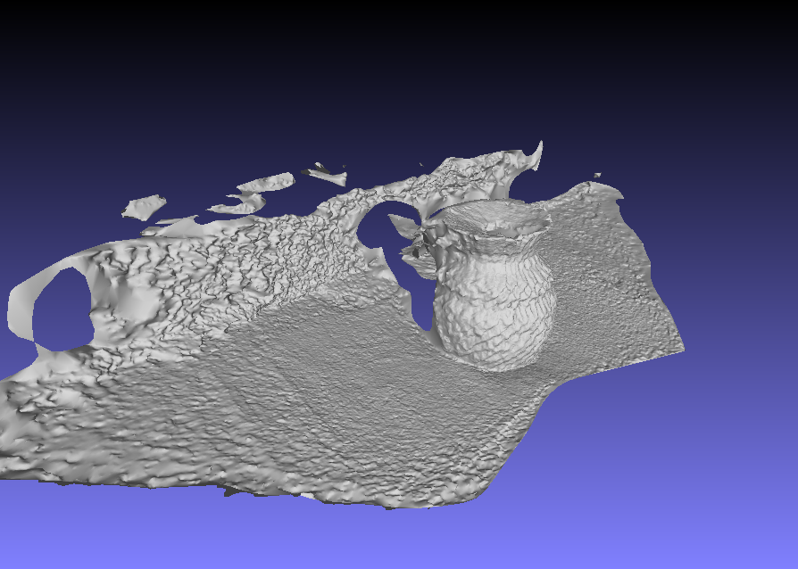

I am really happy with the results here, because the surface was really captured in the dense and mesh versions. The only problem is the interpretation of the background. In the mesh version, it can be seen that there is a separated portion, and I am not sure where it came from. In addition, applying texture was taking forever, so I was not able to model a textured version of it.

### Symmetry
I was a little bit worried at first because the object is a bit glossy, so some features might not be considered. But it all went fine.
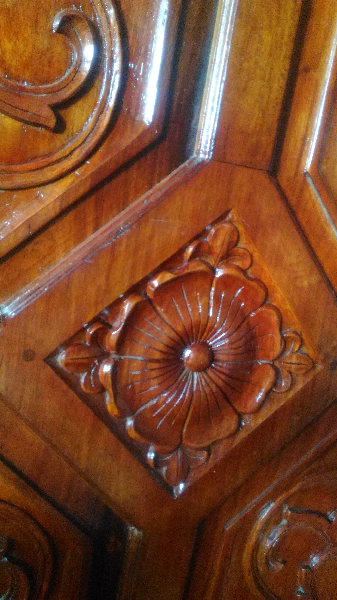

SfM:
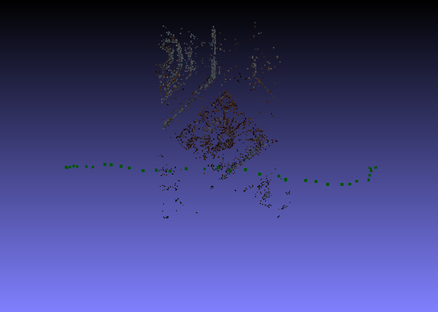

Dense:
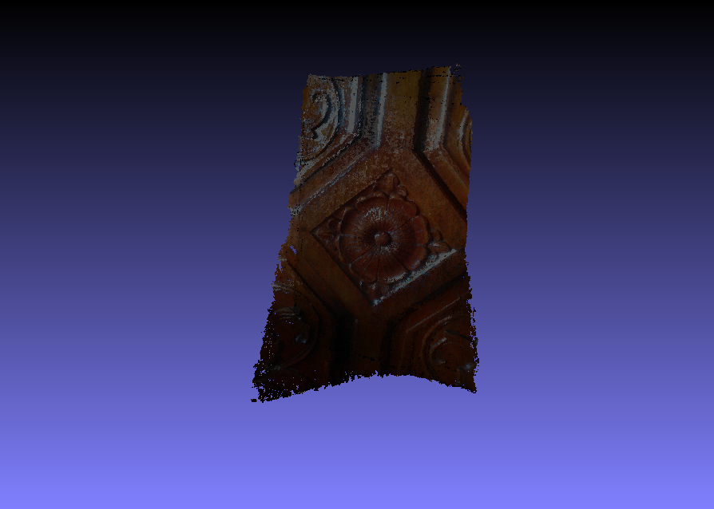

Mesh:
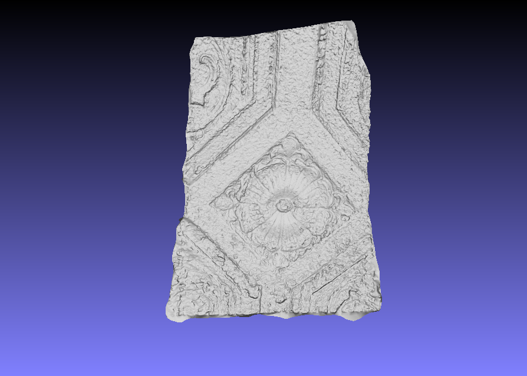

Texture:
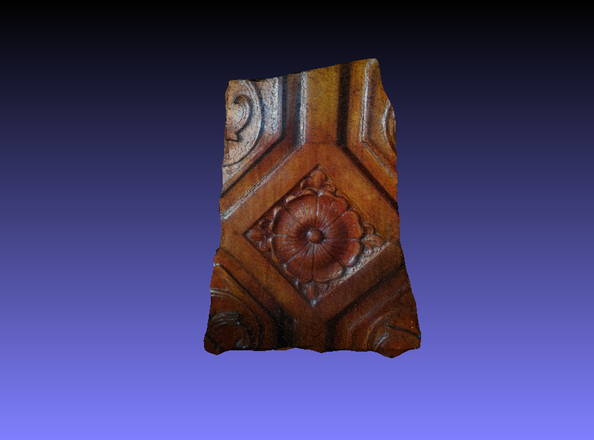

Of all the trials I did this week, this is the only one that was able to reach its textured version. Symmetry was not a problem in this trial. The gloss that I was worried about at the start did not become much of a problem as well, except that it was included in the model. But that cannot be helped. It's what in the images.

Testing the current method with the objects it will find hard to reconstruct unraveled its limitations. Monochrome and dark colors are _impossible_ for the further steps and smooth surfaces become _hollow_. Very complicated texture such as the one showed in the pattern subheading and smooth surfaces require better devices because these compute more.

I am looking forward to learn coloring images and fixing the lighting to solve the color problem. If possible, I want to add such changes in the images before their recalibration.